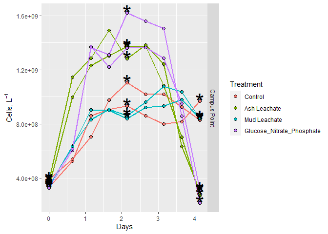
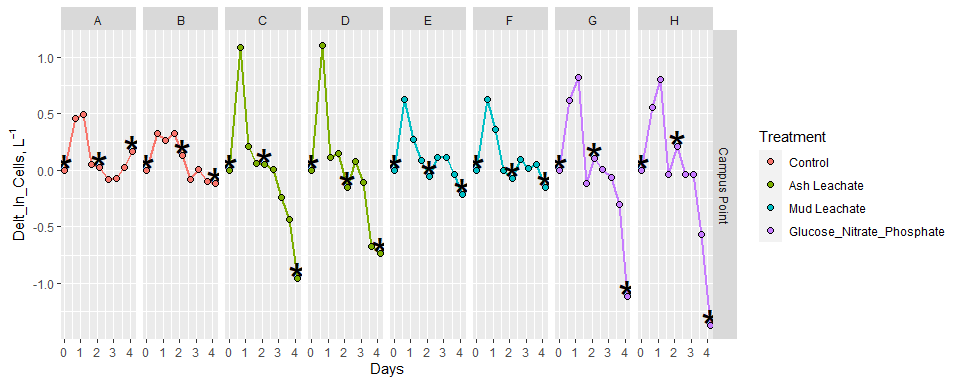
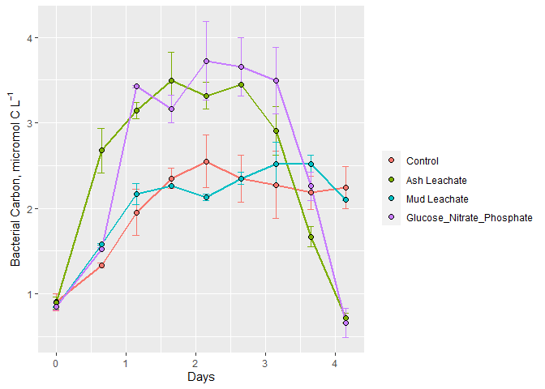
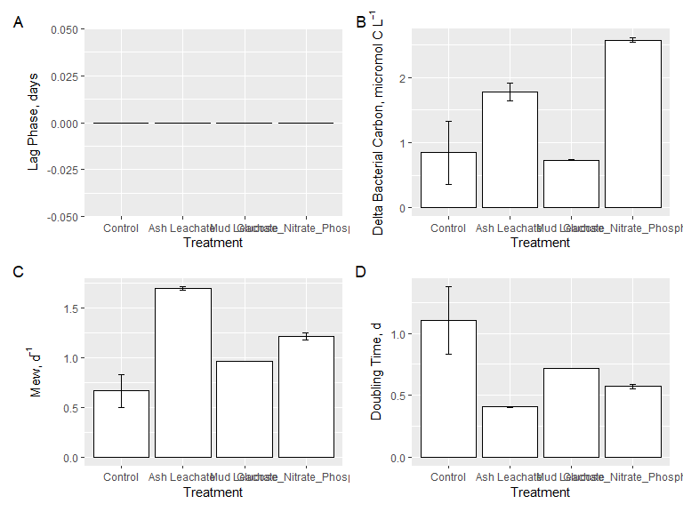

2018Bact\_DataAnalysis
================
KentoLogan
10/30/2020

\#Load Packages\#

``` r
library(tidyverse)
```

    ## -- Attaching packages ------------------------------------------------------------------ tidyverse 1.3.0 --

    ## v ggplot2 3.3.2     v purrr   0.3.4
    ## v tibble  3.0.3     v dplyr   1.0.2
    ## v tidyr   1.1.2     v stringr 1.4.0
    ## v readr   1.3.1     v forcats 0.5.0

    ## -- Conflicts --------------------------------------------------------------------- tidyverse_conflicts() --
    ## x dplyr::filter() masks stats::filter()
    ## x dplyr::lag()    masks stats::lag()

``` r
library(readxl)
library(lubridate)
```

    ## 
    ## Attaching package: 'lubridate'

    ## The following objects are masked from 'package:base':
    ## 
    ##     date, intersect, setdiff, union

\#Import Data

``` r
excel_sheets("~/GitHub_Files/144l_students/Input_Data/week3/144L_2018_BactAbund.xlsx")
```

    ## [1] "Metadata" "Data"

``` r
metadata<- read_excel("~/GitHub_Files/144l_students/Input_Data/week3/144L_2018_BactAbund.xlsx", sheet = "Metadata")
glimpse(metadata)
```

    ## Rows: 80
    ## Columns: 16
    ## $ Experiment           <chr> "144L_2018", "144L_2018", "144L_2018", "144L_2...
    ## $ Location             <chr> "Campus Point", "Campus Point", "Campus Point"...
    ## $ Temperature          <dbl> 20, 20, 20, 20, 20, 20, 20, 20, 20, 20, 20, 20...
    ## $ Depth                <dbl> 1, 1, 1, 1, 1, 1, 1, 1, 1, 1, 1, 1, 1, 1, 1, 1...
    ## $ Bottle               <chr> "A", "A", "A", "A", "A", "A", "A", "A", "A", "...
    ## $ Timepoint            <dbl> 0, 1, 2, 3, 4, 5, 6, 7, 8, 9, 0, 1, 2, 3, 4, 5...
    ## $ Treatment            <chr> "Control", "Control", "Control", "Control", "C...
    ## $ Target_DOC_Amendment <dbl> 0, 0, 0, 0, 0, 0, 0, 0, 0, 0, 0, 0, 0, 0, 0, 0...
    ## $ Inoculum_L           <dbl> 1.5, 1.5, 1.5, 1.5, 1.5, 1.5, 1.5, 1.5, 1.5, 1...
    ## $ Media_L              <dbl> 3.5, 3.5, 3.5, 3.5, 3.5, 3.5, 3.5, 3.5, 3.5, 3...
    ## $ Datetime             <chr> "2018-10-15T16:30", "2018-10-16T08:00", "2018-...
    ## $ TOC_Sample           <lgl> TRUE, FALSE, FALSE, FALSE, TRUE, FALSE, FALSE,...
    ## $ Parallel_Sample      <lgl> TRUE, FALSE, FALSE, FALSE, TRUE, FALSE, FALSE,...
    ## $ Cell_Sample          <lgl> TRUE, TRUE, TRUE, TRUE, TRUE, TRUE, TRUE, TRUE...
    ## $ DNA_Sample           <lgl> TRUE, FALSE, FALSE, FALSE, TRUE, FALSE, FALSE,...
    ## $ DNA_SampleID         <chr> "144_A0_S6", NA, NA, NA, "144_A4_S7", NA, NA, ...

``` r
data<- read_excel("~/GitHub_Files/144l_students/Input_Data/week3/144L_2018_BactAbund.xlsx", sheet = "Data")

joined<- left_join(metadata, data)
```

    ## Joining, by = c("Bottle", "Timepoint")

\#Prepare Data

``` r
Cells<- joined %>% 
  mutate(Datetime= ymd_hm(Datetime),
         cells = Cells_ml *1000) %>% 
  group_by(Treatment,Bottle) %>% 
  mutate(interv= interval(first(Datetime), Datetime)) %>% 
  mutate(hours= interv/3600, days= hours/24) %>% 
  ungroup() %>% 
  select(Experiment: DNA_Sample, cells:days) %>%
  drop_na(cells)
```

\#Plot Growth Curves

``` r
custom.colors<- c("Control"= "#377EB8", "Ash Leachate"= "#4DAF4A", "Mud Leachate"= "#E41A1C", "Glucose_Nitrate_Phosphate"= "#FF7F00")
levels<- c("Control", "Ash Leachate", "Mud Leachate", "Glucose_Nitrate_Phosphate")

Cells %>% 
  mutate(dna= ifelse(DNA_Sample== T, "*", NA)) %>% 
  ggplot(aes(x= days, y= cells, group= interaction(Treatment, Bottle)))+
  geom_line(aes(color= factor(Treatment, levels = levels)), 
            size= 1)+
  geom_point(aes(fill= factor(Treatment, levels = levels)),
             size= 2,
             color= "black",
             shape= 21)+
  geom_text(aes(label= dna), size= 12)+
  labs(x= "Days", y= expression(paste("Cells, L"^-1)), fill="Treatment")+ guides(color=F)+
  facet_grid(rows = "Location")
```

    ## Warning: Removed 48 rows containing missing values (geom_text).

<!-- -->

\#Calculations:

\#\#Exponential Phase\#\# **Note about logs** log(x) = natural log of x
log10(x) = log base 10 of x log2(x) = log base 2 of x

``` r
ln_cells<- Cells %>% 
  group_by(Treatment, Bottle) %>% 
  mutate(ln_cells = log(cells),
         diff_ln_cells = ln_cells - lag(ln_cells, default = first(ln_cells))) %>% 
  ungroup()
```

``` r
ln_cells %>% 
  mutate(dna= ifelse(DNA_Sample== T, "*", NA)) %>% 
  ggplot(aes(x= days, y= diff_ln_cells, group= interaction(Treatment, Bottle)))+
  geom_line(aes(color= factor(Treatment, levels = levels)), 
            size= 1)+
  geom_point(aes(fill= factor(Treatment, levels = levels)),
             size= 2,
             color= "black",
             shape= 21)+
  geom_text(aes(label= dna), size= 12)+
  labs(x= "Days", y= expression(paste("Delt_ln_Cells, L"^-1)), fill="Treatment")+ guides(color=F)+
  facet_grid(Location~Bottle)
```

    ## Warning: Removed 48 rows containing missing values (geom_text).

<!-- -->

\#Growth Rate and Doubling Time

``` r
growth<- ln_cells %>% 
  mutate(exp_start = ifelse(Experiment == "144L_2018" & Bottle =="A", 0, NA),
         exp_start = ifelse(Experiment == "144L_2018" & Bottle =="B", 0, exp_start),
         exp_start = ifelse(Experiment == "144L_2018" & Bottle =="C", 0, exp_start),
         exp_start = ifelse(Experiment == "144L_2018" & Bottle =="D", 0, exp_start),
         exp_start = ifelse(Experiment == "144L_2018" & Bottle =="E", 0, exp_start),
         exp_start = ifelse(Experiment == "144L_2018" & Bottle =="F", 0, exp_start),
         exp_start = ifelse(Experiment == "144L_2018" & Bottle =="G", 0, exp_start),
         exp_start = ifelse(Experiment == "144L_2018" & Bottle =="H", 0, exp_start),
         exp_end = ifelse(Experiment == "144L_2018" & Bottle =="A", 2, NA),
         exp_end = ifelse(Experiment == "144L_2018" & Bottle =="B", 1, exp_end),
         exp_end = ifelse(Experiment == "144L_2018" & Bottle =="C", 1, exp_end),
         exp_end = ifelse(Experiment == "144L_2018" & Bottle =="D", 1, exp_end),
         exp_end = ifelse(Experiment == "144L_2018" & Bottle =="E", 1, exp_end),
         exp_end = ifelse(Experiment == "144L_2018" & Bottle =="F", 1, exp_end),
         exp_end = ifelse(Experiment == "144L_2018" & Bottle =="G", 2, exp_end),
         exp_end = ifelse(Experiment == "144L_2018" & Bottle =="H", 2, exp_end)) %>% 
  group_by(Treatment, Bottle) %>%
  mutate(ln_cells_exp_start = ifelse(Timepoint==exp_start, ln_cells, NA), 
         ln_cells_exp_end = ifelse(Timepoint== exp_end, ln_cells, NA),
         cells_exp_start = ifelse(Timepoint==exp_start, cells, NA), 
         cells_exp_end = ifelse(Timepoint== exp_end, cells, NA),
         days_exp_start = ifelse(Timepoint==exp_start, days, NA), 
         days_exp_end = ifelse(Timepoint== exp_end, days, NA)) %>% 
  fill(ln_cells_exp_start:days_exp_end, .direction = "updown") %>% 
  mutate(mew= (ln_cells_exp_end - ln_cells_exp_start)/(days_exp_end - days_exp_start),
         doubling= log(2)/mew,
         delta_cells= cells_exp_end-first(cells)) %>% 
  ungroup()
```

\#Bacterial Carbon: apply a CCF to bacterial abundances \~ 30 fg C
cell<sup>-1</sup> (from Fukuda et al., 1998)

``` r
bactcarbon<- growth %>% 
  mutate(bc = cells*(2.5*10^-9), 
         delta_bc = delta_cells*(2.5*10^-9),)
```

\#Treatment Averages

``` r
averages<- bactcarbon %>% 
  group_by(Treatment, Timepoint) %>% 
  mutate(ave_bc = mean(bc),
         sd_bc = sd(bc)) %>% 
  ungroup() %>% 
  group_by(Treatment) %>% 
  mutate(ave_mew= mean(mew),
         sd_mew= sd(mew),
         ave_doub= mean(doubling),
         sd_doub= sd(doubling),
         ave_delta_celss= mean(delta_cells),
         sd_delta_cells= sd(delta_cells),
         ave_delta_bc= mean(delta_bc),
         sd_delta_bc= sd(delta_bc),
         ave_lag= mean(days_exp_start),
         sd_lag = sd(days_exp_start)) %>% 
  ungroup()
```

\#Plot Treatment Averages

``` r
averages %>% 
  ggplot(aes(x=days , y=ave_bc),
         group= interaction(Treatment))+
  geom_errorbar(aes(ymin= ave_bc - sd_bc, ymax= ave_bc + sd_bc, color= factor(Treatment, levels = levels)), width= 0.1)+
  geom_line(aes(color= factor(Treatment, levels = levels)), size=1)+
geom_point(aes(fill= factor(Treatment, levels = levels)), color= "black", shape=21, size=2)+
  labs(x= "Days", y= expression("Bacterial Carbon, micromol C L"^-1), color= "", fill= "")+
  guides(color=F)
```

<!-- -->

\#Barplots

``` r
bar.data<- averages %>%
  select(Treatment, ave_mew:sd_lag) %>% 
  distinct()
```

``` r
mew<- bar.data %>% 
  ggplot(aes(x= factor(Treatment, levels = levels), y= ave_mew), group= interaction(Treatment))+
  geom_col(color= "black", fill= "white")+
  geom_errorbar(aes(ymin= ave_mew-sd_mew, ymax= ave_mew+sd_mew), width= 0.1)+
  labs(x= "Treatment", y= expression("Mew, d"^-1))
```

``` r
doubling<- bar.data %>% 
  ggplot(aes(x= factor(Treatment, levels = levels), y= ave_doub), group= interaction(Treatment))+
  geom_col(color= "black", fill= "white")+
  geom_errorbar(aes(ymin= ave_doub-sd_doub, ymax= ave_doub+sd_doub), width= 0.1)+
  labs(x= "Treatment", y= expression("Doubling Time, d"))
```

``` r
delta_bc<- bar.data %>% 
  ggplot(aes(x= factor(Treatment, levels = levels), y= ave_delta_bc), group= interaction(Treatment))+
  geom_col(color= "black", fill= "white")+
  geom_errorbar(aes(ymin= ave_delta_bc-sd_delta_bc, ymax= ave_delta_bc+sd_delta_bc), width= 0.1)+
  labs(x= "Treatment", y= expression("Delta Bacterial Carbon, micromol C L"^-1))
```

``` r
lagtime<- bar.data %>% 
  ggplot(aes(x= factor(Treatment, levels = levels), y= ave_lag), group= interaction(Treatment))+
  geom_col(color= "black", fill= "white")+
  geom_errorbar(aes(ymin= ave_lag-sd_lag, ymax= ave_lag+sd_lag), width= 0.1)+
  labs(x= "Treatment", y= expression("Lag Phase, days"))
```

``` r
library("patchwork")
```

    ## Warning: package 'patchwork' was built under R version 4.0.3

``` r
lagtime+ delta_bc+ mew+ doubling+ plot_annotation(tag_levels = "A")
```

<!-- -->

\#Save Data

``` r
saveRDS(averages, "~/GitHub_Files/144l_students/Output_Data/2018_Processed_Bact_Abund_OFFICIAL.rds")
```
