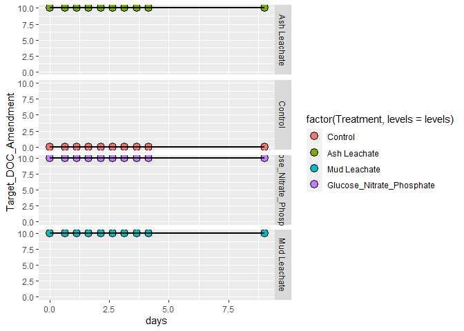

ACIDD Experiment Bacterial Abundance
================
KentoLogan
10/26/2020

\#Intro This doc shows **individual bottle** bacterial abundance data
from ACIDD was processed, QC’d, and analyzed.

``` r
library(tidyverse)
library(lubridate)
library(readxl)
```

\#Import Data

``` r
excel_sheets("~/GitHub_Files/144l_students/Input_Data/week3/144L_2018_BactAbund.xlsx" )
```

    ## [1] "Metadata" "Data"

``` r
data<- read_excel("~/GitHub_Files/144l_students/Input_Data/week3/144L_2018_BactAbund.xlsx")
metadata<- read_excel("~/GitHub_Files/144l_students/Input_Data/week3/144L_2018_BactAbund.xlsx")
joined<- left_join(metadata, data)
```

    ## Joining, by = c("Experiment", "Location", "Temperature", "Depth", "Bottle", "Timepoint", "Treatment", "Target_DOC_Amendment", "Inoculum_L", "Media_L", "Datetime", "TOC_Sample", "Parallel_Sample", "Cell_Sample", "DNA_Sample", "DNA_SampleID")

\#Prepare The Data Convert Date and Time column values from char to
dates, add a column with time elapsed for each exp. Select VOIs and drop
NAs

``` r
samples<- joined %>% 
mutate(Datetime = ymd_hm(Datetime)) %>% 
  group_by(Experiment,Treatment, Bottle) %>%
  mutate(interv = interval(first(Datetime), Datetime), 
         hours = interv/3600,
         days = hours/24) %>% 
  ungroup() %>% 
  select(Experiment:days)
```

\#Plot Curves

``` r
custom_colors<- c("Control"= "#377EB8", "Ash Leachate"= "#4DAF4A", "Mud Leachate"= "#E41A1C", "Glucose_Nitrate_Phosphate" ="FF7F00")
levels<- c("Control","Ash Leachate","Mud Leachate","Glucose_Nitrate_Phosphate")

samples %>% 
  ggplot(aes(x= days, y= Target_DOC_Amendment, group= interaction(Experiment, Treatment, Bottle)))+
  geom_point(aes(fill= factor(Treatment, levels=levels)), size=4, color= "black", shape= 21)+
  geom_line(aes(fill=factor(Treatment, levels = levels)), size= 1, color= "black", shape= 21)+
  facet_grid(rows = "Treatment")
```

    ## Warning: Ignoring unknown parameters: shape

    ## Warning: Ignoring unknown aesthetics: fill

<!-- -->
