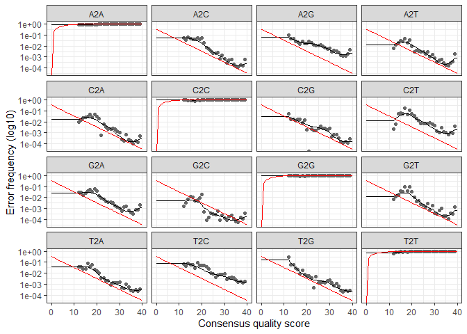
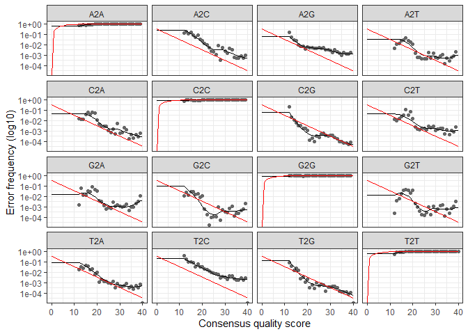

DADA\_2\_2018\_Data
================
KentoLogan
11/12/2020

\#Install and Load DADA2 and ShortRead

``` r
if (!requireNamespace("BiocManager", quietly = TRUE))
    install.packages("BiocManager")
BiocManager::install(version = '3.11')
```

    ## Bioconductor version 3.11 (BiocManager 1.30.10), R 4.0.2 (2020-06-22)

    ## Installation path not writeable, unable to update packages: codetools,
    ##   KernSmooth, MASS, mgcv, nlme, survival

    ## Old packages: 'colorspace', 'digest', 'lubridate', 'rlang', 'tibble', 'xfun'

``` r
BiocManager::install("dada2", version = "3.11")
```

    ## Bioconductor version 3.11 (BiocManager 1.30.10), R 4.0.2 (2020-06-22)

    ## Installing package(s) 'dada2'

    ## package 'dada2' successfully unpacked and MD5 sums checked

    ## Warning: cannot remove prior installation of package 'dada2'

    ## Warning in file.copy(savedcopy, lib, recursive = TRUE): problem copying C:
    ## \Users\arakn\Documents\R\win-library\4.0\00LOCK\dada2\libs\x64\dada2.dll to C:
    ## \Users\arakn\Documents\R\win-library\4.0\dada2\libs\x64\dada2.dll: Permission
    ## denied

    ## Warning: restored 'dada2'

    ## 
    ## The downloaded binary packages are in
    ##  C:\Users\arakn\AppData\Local\Temp\RtmpSOMqRi\downloaded_packages

    ## Installation path not writeable, unable to update packages: codetools,
    ##   KernSmooth, MASS, mgcv, nlme, survival

    ## Old packages: 'colorspace', 'digest', 'lubridate', 'rlang', 'tibble', 'xfun'

``` r
BiocManager::install("ShortRead")
```

    ## Bioconductor version 3.11 (BiocManager 1.30.10), R 4.0.2 (2020-06-22)

    ## Installing package(s) 'ShortRead'

    ## package 'ShortRead' successfully unpacked and MD5 sums checked

    ## Warning: cannot remove prior installation of package 'ShortRead'

    ## Warning in file.copy(savedcopy, lib, recursive = TRUE): problem copying C:
    ## \Users\arakn\Documents\R\win-library\4.0\00LOCK\ShortRead\libs\x64\ShortRead.dll
    ## to C:\Users\arakn\Documents\R\win-library\4.0\ShortRead\libs\x64\ShortRead.dll:
    ## Permission denied

    ## Warning: restored 'ShortRead'

    ## 
    ## The downloaded binary packages are in
    ##  C:\Users\arakn\AppData\Local\Temp\RtmpSOMqRi\downloaded_packages

    ## Installation path not writeable, unable to update packages: codetools,
    ##   KernSmooth, MASS, mgcv, nlme, survival

    ## Old packages: 'colorspace', 'digest', 'lubridate', 'rlang', 'tibble', 'xfun'

``` r
library(tidyverse)
```

    ## -- Attaching packages --------------------------------------- tidyverse 1.3.0 --

    ## v ggplot2 3.3.2     v purrr   0.3.4
    ## v tibble  3.0.3     v dplyr   1.0.2
    ## v tidyr   1.1.2     v stringr 1.4.0
    ## v readr   1.4.0     v forcats 0.5.0

    ## Warning: package 'readr' was built under R version 4.0.3

    ## -- Conflicts ------------------------------------------ tidyverse_conflicts() --
    ## x dplyr::filter() masks stats::filter()
    ## x dplyr::lag()    masks stats::lag()

``` r
library(dada2)
```

    ## Loading required package: Rcpp

``` r
library(ShortRead)
```

    ## Loading required package: BiocGenerics

    ## Loading required package: parallel

    ## 
    ## Attaching package: 'BiocGenerics'

    ## The following objects are masked from 'package:parallel':
    ## 
    ##     clusterApply, clusterApplyLB, clusterCall, clusterEvalQ,
    ##     clusterExport, clusterMap, parApply, parCapply, parLapply,
    ##     parLapplyLB, parRapply, parSapply, parSapplyLB

    ## The following objects are masked from 'package:dplyr':
    ## 
    ##     combine, intersect, setdiff, union

    ## The following objects are masked from 'package:stats':
    ## 
    ##     IQR, mad, sd, var, xtabs

    ## The following objects are masked from 'package:base':
    ## 
    ##     anyDuplicated, append, as.data.frame, basename, cbind, colnames,
    ##     dirname, do.call, duplicated, eval, evalq, Filter, Find, get, grep,
    ##     grepl, intersect, is.unsorted, lapply, Map, mapply, match, mget,
    ##     order, paste, pmax, pmax.int, pmin, pmin.int, Position, rank,
    ##     rbind, Reduce, rownames, sapply, setdiff, sort, table, tapply,
    ##     union, unique, unsplit, which, which.max, which.min

    ## Loading required package: BiocParallel

    ## Loading required package: Biostrings

    ## Loading required package: S4Vectors

    ## Loading required package: stats4

    ## 
    ## Attaching package: 'S4Vectors'

    ## The following objects are masked from 'package:dplyr':
    ## 
    ##     first, rename

    ## The following object is masked from 'package:tidyr':
    ## 
    ##     expand

    ## The following object is masked from 'package:base':
    ## 
    ##     expand.grid

    ## Loading required package: IRanges

    ## 
    ## Attaching package: 'IRanges'

    ## The following objects are masked from 'package:dplyr':
    ## 
    ##     collapse, desc, slice

    ## The following object is masked from 'package:purrr':
    ## 
    ##     reduce

    ## The following object is masked from 'package:grDevices':
    ## 
    ##     windows

    ## Loading required package: XVector

    ## 
    ## Attaching package: 'XVector'

    ## The following object is masked from 'package:purrr':
    ## 
    ##     compact

    ## 
    ## Attaching package: 'Biostrings'

    ## The following object is masked from 'package:base':
    ## 
    ##     strsplit

    ## Loading required package: Rsamtools

    ## Loading required package: GenomeInfoDb

    ## Loading required package: GenomicRanges

    ## Loading required package: GenomicAlignments

    ## Loading required package: SummarizedExperiment

    ## Loading required package: Biobase

    ## Welcome to Bioconductor
    ## 
    ##     Vignettes contain introductory material; view with
    ##     'browseVignettes()'. To cite Bioconductor, see
    ##     'citation("Biobase")', and for packages 'citation("pkgname")'.

    ## Loading required package: DelayedArray

    ## Loading required package: matrixStats

    ## Warning: package 'matrixStats' was built under R version 4.0.3

    ## 
    ## Attaching package: 'matrixStats'

    ## The following objects are masked from 'package:Biobase':
    ## 
    ##     anyMissing, rowMedians

    ## The following object is masked from 'package:dplyr':
    ## 
    ##     count

    ## 
    ## Attaching package: 'DelayedArray'

    ## The following objects are masked from 'package:matrixStats':
    ## 
    ##     colMaxs, colMins, colRanges, rowMaxs, rowMins, rowRanges

    ## The following object is masked from 'package:purrr':
    ## 
    ##     simplify

    ## The following objects are masked from 'package:base':
    ## 
    ##     aperm, apply, rowsum

    ## 
    ## Attaching package: 'GenomicAlignments'

    ## The following object is masked from 'package:dplyr':
    ## 
    ##     last

    ## 
    ## Attaching package: 'ShortRead'

    ## The following object is masked from 'package:dplyr':
    ## 
    ##     id

    ## The following object is masked from 'package:purrr':
    ## 
    ##     compose

    ## The following object is masked from 'package:tibble':
    ## 
    ##     view

\#Imort File Names

``` r
path<- "~/GitHub_Files/144l_students/Input_Data/week5/EEMB144L_2018_fastq"

fnFs<- list.files(path, pattern = "_R1_001.fastq", full.names = TRUE)
fnRs<- list.files(path, pattern = "_R2_001.fastq", full.names = TRUE)
```

\#Retrieve Orientation of Primers (Tratget V4: 514F-Y and 806RB)

``` r
FWD = "GTGYCAGCMGCCGCGGTAA"
REV = "GGACTACNVGGGTWTCTAAT"

allOrients<- function(primer){
  require(Biostrings)
  dna<- DNAString(primer)
  orients<- c(Forward= dna, Complement= complement(dna), Reverse= reverse(dna),
              RevComp= reverseComplement(dna))
  return(sapply(orients, toString))
}

FWD.orients<- allOrients(FWD)
REV.orients<- allOrients(REV)
```

\#Primer Search

``` r
primerHits<- function(primer, fn){
  nhits<- vcountPattern(primer, sread(readFastq(fn)), fixed= FALSE)
  return(sum(nhits>0))
}

rbind(FWD.ForwardReads= sapply(FWD.orients, primerHits, fn= fnFs[[1]]),
      FWD.ReverseReads= sapply(FWD.orients, primerHits, fn= fnRs[[1]]),
      REV.ForwardReads= sapply(FWD.orients, primerHits, fn= fnFs[[1]]),
      REV.ReverseReads= sapply(FWD.orients, primerHits, fn= fnRs[[1]]))
```

    ##                  Forward Complement Reverse RevComp
    ## FWD.ForwardReads       0          0       0       0
    ## FWD.ReverseReads       0          0       0     283
    ## REV.ForwardReads       0          0       0       0
    ## REV.ReverseReads       0          0       0     283

\#Inspect Quality Read Profiles \#\#FORWARD READS:

``` r
plotQualityProfile(fnFs[1:24])
```

<!-- -->
\#\#REVERSE READS:

``` r
plotQualityProfile(fnRs[1:24])
```

<!-- -->

\#\#TRIMMING

``` r
sample.names<- sapply(strsplit(basename(fnFs), "_L"), '[',1)

filt_path<- file.path(path, "filtered")
filtFs<- file.path(filt_path, paste0(sample.names, "_F_filt.fastq"))
filtRs<- file.path(filt_path, paste0(sample.names, "_R_filt.fastq"))
```

``` r
out<- filterAndTrim(fnFs, filtFs, fnRs, filtRs, truncLen = c(200, 150), maxN = 0, maxEE = c(2,2), truncQ = 2, rm.phix = TRUE, compress = TRUE)
readsinout<- out
```

\#Error Rates

``` r
errF<-learnErrors(filtFs, multithread = TRUE)
```

    ## 110953600 total bases in 554768 reads from 12 samples will be used for learning the error rates.

``` r
errR<-learnErrors(filtRs, multithread = TRUE)
```

    ## 100750050 total bases in 671667 reads from 15 samples will be used for learning the error rates.

``` r
plotErrors(errF, nominalQ = TRUE)
```

    ## Warning: Transformation introduced infinite values in continuous y-axis
    
    ## Warning: Transformation introduced infinite values in continuous y-axis

<!-- -->

``` r
plotErrors(errR, nominalQ = TRUE)
```

    ## Warning: Transformation introduced infinite values in continuous y-axis
    
    ## Warning: Transformation introduced infinite values in continuous y-axis

<!-- -->

\#\#Dereplication

``` r
derepFs<- derepFastq(filtFs, verbose = TRUE)
```

    ## Dereplicating sequence entries in Fastq file: ~/GitHub_Files/144l_students/Input_Data/week5/EEMB144L_2018_fastq/filtered/144_A0_S6_F_filt.fastq

    ## Encountered 17611 unique sequences from 70868 total sequences read.

    ## Dereplicating sequence entries in Fastq file: ~/GitHub_Files/144l_students/Input_Data/week5/EEMB144L_2018_fastq/filtered/144_A4_S7_F_filt.fastq

    ## Encountered 8523 unique sequences from 33172 total sequences read.

    ## Dereplicating sequence entries in Fastq file: ~/GitHub_Files/144l_students/Input_Data/week5/EEMB144L_2018_fastq/filtered/144_A8_S8_F_filt.fastq

    ## Encountered 11776 unique sequences from 45283 total sequences read.

    ## Dereplicating sequence entries in Fastq file: ~/GitHub_Files/144l_students/Input_Data/week5/EEMB144L_2018_fastq/filtered/144_B0_S9_F_filt.fastq

    ## Encountered 1394 unique sequences from 3286 total sequences read.

    ## Dereplicating sequence entries in Fastq file: ~/GitHub_Files/144l_students/Input_Data/week5/EEMB144L_2018_fastq/filtered/144_B4_S10_F_filt.fastq

    ## Encountered 10927 unique sequences from 45432 total sequences read.

    ## Dereplicating sequence entries in Fastq file: ~/GitHub_Files/144l_students/Input_Data/week5/EEMB144L_2018_fastq/filtered/144_B8_S11_F_filt.fastq

    ## Encountered 13739 unique sequences from 56216 total sequences read.

    ## Dereplicating sequence entries in Fastq file: ~/GitHub_Files/144l_students/Input_Data/week5/EEMB144L_2018_fastq/filtered/144_C0_S12_F_filt.fastq

    ## Encountered 7426 unique sequences from 25214 total sequences read.

    ## Dereplicating sequence entries in Fastq file: ~/GitHub_Files/144l_students/Input_Data/week5/EEMB144L_2018_fastq/filtered/144_C4_S13_F_filt.fastq

    ## Encountered 12758 unique sequences from 62942 total sequences read.

    ## Dereplicating sequence entries in Fastq file: ~/GitHub_Files/144l_students/Input_Data/week5/EEMB144L_2018_fastq/filtered/144_C8_S14_F_filt.fastq

    ## Encountered 12894 unique sequences from 54965 total sequences read.

    ## Dereplicating sequence entries in Fastq file: ~/GitHub_Files/144l_students/Input_Data/week5/EEMB144L_2018_fastq/filtered/144_D0_S15_F_filt.fastq

    ## Encountered 13967 unique sequences from 57502 total sequences read.

    ## Dereplicating sequence entries in Fastq file: ~/GitHub_Files/144l_students/Input_Data/week5/EEMB144L_2018_fastq/filtered/144_D4_S16_F_filt.fastq

    ## Encountered 8744 unique sequences from 44769 total sequences read.

    ## Dereplicating sequence entries in Fastq file: ~/GitHub_Files/144l_students/Input_Data/week5/EEMB144L_2018_fastq/filtered/144_D8_S17_F_filt.fastq

    ## Encountered 13616 unique sequences from 55119 total sequences read.

    ## Dereplicating sequence entries in Fastq file: ~/GitHub_Files/144l_students/Input_Data/week5/EEMB144L_2018_fastq/filtered/144_E0_S18_F_filt.fastq

    ## Encountered 12580 unique sequences from 49019 total sequences read.

    ## Dereplicating sequence entries in Fastq file: ~/GitHub_Files/144l_students/Input_Data/week5/EEMB144L_2018_fastq/filtered/144_E4_S19_F_filt.fastq

    ## Encountered 8678 unique sequences from 37467 total sequences read.

    ## Dereplicating sequence entries in Fastq file: ~/GitHub_Files/144l_students/Input_Data/week5/EEMB144L_2018_fastq/filtered/144_E8_S20_F_filt.fastq

    ## Encountered 7830 unique sequences from 30413 total sequences read.

    ## Dereplicating sequence entries in Fastq file: ~/GitHub_Files/144l_students/Input_Data/week5/EEMB144L_2018_fastq/filtered/144_F0_S21_F_filt.fastq

    ## Encountered 12981 unique sequences from 49975 total sequences read.

    ## Dereplicating sequence entries in Fastq file: ~/GitHub_Files/144l_students/Input_Data/week5/EEMB144L_2018_fastq/filtered/144_F4_S22_F_filt.fastq

    ## Encountered 7337 unique sequences from 29889 total sequences read.

    ## Dereplicating sequence entries in Fastq file: ~/GitHub_Files/144l_students/Input_Data/week5/EEMB144L_2018_fastq/filtered/144_F8_S23_F_filt.fastq

    ## Encountered 7303 unique sequences from 30792 total sequences read.

    ## Dereplicating sequence entries in Fastq file: ~/GitHub_Files/144l_students/Input_Data/week5/EEMB144L_2018_fastq/filtered/144_G0_S24_F_filt.fastq

    ## Encountered 9886 unique sequences from 37648 total sequences read.

    ## Dereplicating sequence entries in Fastq file: ~/GitHub_Files/144l_students/Input_Data/week5/EEMB144L_2018_fastq/filtered/144_G4_S25_F_filt.fastq

    ## Encountered 7586 unique sequences from 36506 total sequences read.

    ## Dereplicating sequence entries in Fastq file: ~/GitHub_Files/144l_students/Input_Data/week5/EEMB144L_2018_fastq/filtered/144_G8_S26_F_filt.fastq

    ## Encountered 7592 unique sequences from 32774 total sequences read.

    ## Dereplicating sequence entries in Fastq file: ~/GitHub_Files/144l_students/Input_Data/week5/EEMB144L_2018_fastq/filtered/144_H0_S27_F_filt.fastq

    ## Encountered 13584 unique sequences from 59242 total sequences read.

    ## Dereplicating sequence entries in Fastq file: ~/GitHub_Files/144l_students/Input_Data/week5/EEMB144L_2018_fastq/filtered/144_H4_S28_F_filt.fastq

    ## Encountered 5261 unique sequences from 25062 total sequences read.

    ## Dereplicating sequence entries in Fastq file: ~/GitHub_Files/144l_students/Input_Data/week5/EEMB144L_2018_fastq/filtered/144_H8_S29_F_filt.fastq

    ## Encountered 8537 unique sequences from 33766 total sequences read.

``` r
derepRS<- derepFastq(filtRs, verbose = TRUE)
```

    ## Dereplicating sequence entries in Fastq file: ~/GitHub_Files/144l_students/Input_Data/week5/EEMB144L_2018_fastq/filtered/144_A0_S6_R_filt.fastq

    ## Encountered 24175 unique sequences from 70868 total sequences read.

    ## Dereplicating sequence entries in Fastq file: ~/GitHub_Files/144l_students/Input_Data/week5/EEMB144L_2018_fastq/filtered/144_A4_S7_R_filt.fastq

    ## Encountered 11316 unique sequences from 33172 total sequences read.

    ## Dereplicating sequence entries in Fastq file: ~/GitHub_Files/144l_students/Input_Data/week5/EEMB144L_2018_fastq/filtered/144_A8_S8_R_filt.fastq

    ## Encountered 16625 unique sequences from 45283 total sequences read.

    ## Dereplicating sequence entries in Fastq file: ~/GitHub_Files/144l_students/Input_Data/week5/EEMB144L_2018_fastq/filtered/144_B0_S9_R_filt.fastq

    ## Encountered 1770 unique sequences from 3286 total sequences read.

    ## Dereplicating sequence entries in Fastq file: ~/GitHub_Files/144l_students/Input_Data/week5/EEMB144L_2018_fastq/filtered/144_B4_S10_R_filt.fastq

    ## Encountered 15567 unique sequences from 45432 total sequences read.

    ## Dereplicating sequence entries in Fastq file: ~/GitHub_Files/144l_students/Input_Data/week5/EEMB144L_2018_fastq/filtered/144_B8_S11_R_filt.fastq

    ## Encountered 20652 unique sequences from 56216 total sequences read.

    ## Dereplicating sequence entries in Fastq file: ~/GitHub_Files/144l_students/Input_Data/week5/EEMB144L_2018_fastq/filtered/144_C0_S12_R_filt.fastq

    ## Encountered 12162 unique sequences from 25214 total sequences read.

    ## Dereplicating sequence entries in Fastq file: ~/GitHub_Files/144l_students/Input_Data/week5/EEMB144L_2018_fastq/filtered/144_C4_S13_R_filt.fastq

    ## Encountered 19438 unique sequences from 62942 total sequences read.

    ## Dereplicating sequence entries in Fastq file: ~/GitHub_Files/144l_students/Input_Data/week5/EEMB144L_2018_fastq/filtered/144_C8_S14_R_filt.fastq

    ## Encountered 18981 unique sequences from 54965 total sequences read.

    ## Dereplicating sequence entries in Fastq file: ~/GitHub_Files/144l_students/Input_Data/week5/EEMB144L_2018_fastq/filtered/144_D0_S15_R_filt.fastq

    ## Encountered 20947 unique sequences from 57502 total sequences read.

    ## Dereplicating sequence entries in Fastq file: ~/GitHub_Files/144l_students/Input_Data/week5/EEMB144L_2018_fastq/filtered/144_D4_S16_R_filt.fastq

    ## Encountered 14888 unique sequences from 44769 total sequences read.

    ## Dereplicating sequence entries in Fastq file: ~/GitHub_Files/144l_students/Input_Data/week5/EEMB144L_2018_fastq/filtered/144_D8_S17_R_filt.fastq

    ## Encountered 21171 unique sequences from 55119 total sequences read.

    ## Dereplicating sequence entries in Fastq file: ~/GitHub_Files/144l_students/Input_Data/week5/EEMB144L_2018_fastq/filtered/144_E0_S18_R_filt.fastq

    ## Encountered 18785 unique sequences from 49019 total sequences read.

    ## Dereplicating sequence entries in Fastq file: ~/GitHub_Files/144l_students/Input_Data/week5/EEMB144L_2018_fastq/filtered/144_E4_S19_R_filt.fastq

    ## Encountered 14665 unique sequences from 37467 total sequences read.

    ## Dereplicating sequence entries in Fastq file: ~/GitHub_Files/144l_students/Input_Data/week5/EEMB144L_2018_fastq/filtered/144_E8_S20_R_filt.fastq

    ## Encountered 15767 unique sequences from 30413 total sequences read.

    ## Dereplicating sequence entries in Fastq file: ~/GitHub_Files/144l_students/Input_Data/week5/EEMB144L_2018_fastq/filtered/144_F0_S21_R_filt.fastq

    ## Encountered 19823 unique sequences from 49975 total sequences read.

    ## Dereplicating sequence entries in Fastq file: ~/GitHub_Files/144l_students/Input_Data/week5/EEMB144L_2018_fastq/filtered/144_F4_S22_R_filt.fastq

    ## Encountered 10390 unique sequences from 29889 total sequences read.

    ## Dereplicating sequence entries in Fastq file: ~/GitHub_Files/144l_students/Input_Data/week5/EEMB144L_2018_fastq/filtered/144_F8_S23_R_filt.fastq

    ## Encountered 10140 unique sequences from 30792 total sequences read.

    ## Dereplicating sequence entries in Fastq file: ~/GitHub_Files/144l_students/Input_Data/week5/EEMB144L_2018_fastq/filtered/144_G0_S24_R_filt.fastq

    ## Encountered 14019 unique sequences from 37648 total sequences read.

    ## Dereplicating sequence entries in Fastq file: ~/GitHub_Files/144l_students/Input_Data/week5/EEMB144L_2018_fastq/filtered/144_G4_S25_R_filt.fastq

    ## Encountered 12399 unique sequences from 36506 total sequences read.

    ## Dereplicating sequence entries in Fastq file: ~/GitHub_Files/144l_students/Input_Data/week5/EEMB144L_2018_fastq/filtered/144_G8_S26_R_filt.fastq

    ## Encountered 10835 unique sequences from 32774 total sequences read.

    ## Dereplicating sequence entries in Fastq file: ~/GitHub_Files/144l_students/Input_Data/week5/EEMB144L_2018_fastq/filtered/144_H0_S27_R_filt.fastq

    ## Encountered 20646 unique sequences from 59242 total sequences read.

    ## Dereplicating sequence entries in Fastq file: ~/GitHub_Files/144l_students/Input_Data/week5/EEMB144L_2018_fastq/filtered/144_H4_S28_R_filt.fastq

    ## Encountered 10356 unique sequences from 25062 total sequences read.

    ## Dereplicating sequence entries in Fastq file: ~/GitHub_Files/144l_students/Input_Data/week5/EEMB144L_2018_fastq/filtered/144_H8_S29_R_filt.fastq

    ## Encountered 12193 unique sequences from 33766 total sequences read.

``` r
names(derepFs)<- sample.names
names(derepRS)<- sample.names
```

\#\#Infer Sequence Variants

``` r
dadaFs<- dada(derepFs, err = errF, multithread = TRUE)
```

    ## Sample 1 - 70868 reads in 17611 unique sequences.
    ## Sample 2 - 33172 reads in 8523 unique sequences.
    ## Sample 3 - 45283 reads in 11776 unique sequences.
    ## Sample 4 - 3286 reads in 1394 unique sequences.
    ## Sample 5 - 45432 reads in 10927 unique sequences.
    ## Sample 6 - 56216 reads in 13739 unique sequences.
    ## Sample 7 - 25214 reads in 7426 unique sequences.
    ## Sample 8 - 62942 reads in 12758 unique sequences.
    ## Sample 9 - 54965 reads in 12894 unique sequences.
    ## Sample 10 - 57502 reads in 13967 unique sequences.
    ## Sample 11 - 44769 reads in 8744 unique sequences.
    ## Sample 12 - 55119 reads in 13616 unique sequences.
    ## Sample 13 - 49019 reads in 12580 unique sequences.
    ## Sample 14 - 37467 reads in 8678 unique sequences.
    ## Sample 15 - 30413 reads in 7830 unique sequences.
    ## Sample 16 - 49975 reads in 12981 unique sequences.
    ## Sample 17 - 29889 reads in 7337 unique sequences.
    ## Sample 18 - 30792 reads in 7303 unique sequences.
    ## Sample 19 - 37648 reads in 9886 unique sequences.
    ## Sample 20 - 36506 reads in 7586 unique sequences.
    ## Sample 21 - 32774 reads in 7592 unique sequences.
    ## Sample 22 - 59242 reads in 13584 unique sequences.
    ## Sample 23 - 25062 reads in 5261 unique sequences.
    ## Sample 24 - 33766 reads in 8537 unique sequences.

``` r
dadaRs<- dada(derepRS, err = errR, multithread = TRUE)
```

    ## Sample 1 - 70868 reads in 24175 unique sequences.
    ## Sample 2 - 33172 reads in 11316 unique sequences.
    ## Sample 3 - 45283 reads in 16625 unique sequences.
    ## Sample 4 - 3286 reads in 1770 unique sequences.
    ## Sample 5 - 45432 reads in 15567 unique sequences.
    ## Sample 6 - 56216 reads in 20652 unique sequences.
    ## Sample 7 - 25214 reads in 12162 unique sequences.
    ## Sample 8 - 62942 reads in 19438 unique sequences.
    ## Sample 9 - 54965 reads in 18981 unique sequences.
    ## Sample 10 - 57502 reads in 20947 unique sequences.
    ## Sample 11 - 44769 reads in 14888 unique sequences.
    ## Sample 12 - 55119 reads in 21171 unique sequences.
    ## Sample 13 - 49019 reads in 18785 unique sequences.
    ## Sample 14 - 37467 reads in 14665 unique sequences.
    ## Sample 15 - 30413 reads in 15767 unique sequences.
    ## Sample 16 - 49975 reads in 19823 unique sequences.
    ## Sample 17 - 29889 reads in 10390 unique sequences.
    ## Sample 18 - 30792 reads in 10140 unique sequences.
    ## Sample 19 - 37648 reads in 14019 unique sequences.
    ## Sample 20 - 36506 reads in 12399 unique sequences.
    ## Sample 21 - 32774 reads in 10835 unique sequences.
    ## Sample 22 - 59242 reads in 20646 unique sequences.
    ## Sample 23 - 25062 reads in 10356 unique sequences.
    ## Sample 24 - 33766 reads in 12193 unique sequences.

\#\#Merge Overlapping

``` r
mergers<- mergePairs(dadaFs, derepFs, dadaRs, derepRS, verbose = TRUE, trimOverhang = T)
```

    ## 67488 paired-reads (in 337 unique pairings) successfully merged out of 70016 (in 919 pairings) input.

    ## 31521 paired-reads (in 166 unique pairings) successfully merged out of 32548 (in 495 pairings) input.

    ## 43338 paired-reads (in 229 unique pairings) successfully merged out of 44672 (in 637 pairings) input.

    ## 2834 paired-reads (in 70 unique pairings) successfully merged out of 3053 (in 180 pairings) input.

    ## 43547 paired-reads (in 189 unique pairings) successfully merged out of 44815 (in 563 pairings) input.

    ## 53945 paired-reads (in 249 unique pairings) successfully merged out of 55532 (in 682 pairings) input.

    ## 23399 paired-reads (in 207 unique pairings) successfully merged out of 24632 (in 533 pairings) input.

    ## 61134 paired-reads (in 173 unique pairings) successfully merged out of 62173 (in 545 pairings) input.

    ## 53096 paired-reads (in 229 unique pairings) successfully merged out of 54429 (in 574 pairings) input.

    ## 54656 paired-reads (in 298 unique pairings) successfully merged out of 56615 (in 722 pairings) input.

    ## 43396 paired-reads (in 123 unique pairings) successfully merged out of 44304 (in 344 pairings) input.

    ## 53165 paired-reads (in 220 unique pairings) successfully merged out of 54536 (in 555 pairings) input.

    ## 46486 paired-reads (in 265 unique pairings) successfully merged out of 48192 (in 614 pairings) input.

    ## 35900 paired-reads (in 163 unique pairings) successfully merged out of 37001 (in 436 pairings) input.

    ## 28472 paired-reads (in 161 unique pairings) successfully merged out of 29793 (in 525 pairings) input.

    ## 46737 paired-reads (in 255 unique pairings) successfully merged out of 48889 (in 655 pairings) input.

    ## 28793 paired-reads (in 138 unique pairings) successfully merged out of 29584 (in 299 pairings) input.

    ## 29694 paired-reads (in 190 unique pairings) successfully merged out of 30478 (in 355 pairings) input.

    ## 35711 paired-reads (in 226 unique pairings) successfully merged out of 37011 (in 451 pairings) input.

    ## 35287 paired-reads (in 138 unique pairings) successfully merged out of 36111 (in 377 pairings) input.

    ## 31371 paired-reads (in 158 unique pairings) successfully merged out of 32263 (in 325 pairings) input.

    ## 54517 paired-reads (in 302 unique pairings) successfully merged out of 58549 (in 630 pairings) input.

    ## 23994 paired-reads (in 118 unique pairings) successfully merged out of 24764 (in 319 pairings) input.

    ## 32510 paired-reads (in 162 unique pairings) successfully merged out of 33297 (in 320 pairings) input.

\#\#Save Mergers

``` r
saveRDS(mergers, "~/GitHub_Files/144l_students/Output_Data/dada_merged_.rds")
```

\#\#Sequence Table

``` r
seqtab<- makeSequenceTable(mergers)
dim(seqtab)
```

    ## [1]  24 970

\#\#Check Distribution

``` r
table(nchar(getSequences(seqtab)))
```

    ## 
    ## 252 253 254 255 256 257 258 265 266 270 
    ##  25 873  52   4   5   2   4   1   1   3

\#\#Remove Chimeras

``` r
seqtab.nochim<- removeBimeraDenovo(seqtab, verbose = TRUE)
```

    ## Identified 81 bimeras out of 970 input sequences.

``` r
dim(seqtab.nochim)
```

    ## [1]  24 889

\#\#Non-Chimera Proportion:

``` r
sum(seqtab.nochim)/sum(seqtab)
```

    ## [1] 0.9929833

\#ASSIGN TAXA

``` r
taxa<- assignTaxonomy(seqtab.nochim, "~/GitHub_Files/144l_students/Input_Data/week5/Reference_Database-20201114T014303Z-001/Reference_Database/silva_nr_v138_train_set.fa", multithread = TRUE)
```

``` r
saveRDS(t(seqtab.nochim),
 "~/GitHub_Files/144l_students/Output_Data/seqtab-nochimtaxa.rds")
saveRDS(taxa,"~/GitHub_Files/144l_students/Output_Data/taxa.rds")
```
