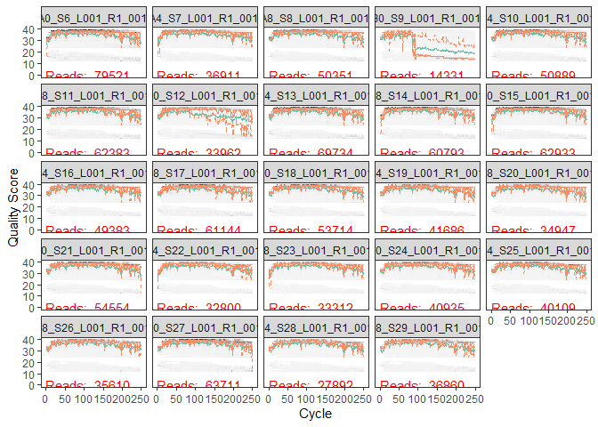
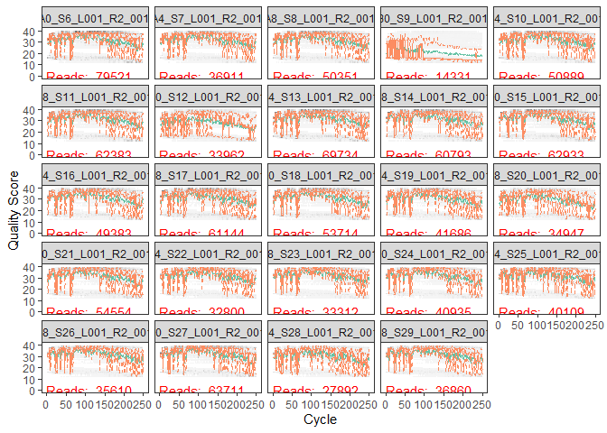

DADA\_2\_2018\_Data
================
KentoLogan
11/12/2020

\#Install and Load DADA2 and ShortRead

``` r
if (!requireNamespace("BiocManager", quietly = TRUE))
    install.packages("BiocManager")
BiocManager::install(version = '3.11')
```

    ## Bioconductor version 3.11 (BiocManager 1.30.10), R 4.0.2 (2020-06-22)

    ## Installation path not writeable, unable to update packages: codetools,
    ##   KernSmooth, MASS, mgcv, nlme, survival

    ## Old packages: 'colorspace', 'digest', 'lubridate', 'rlang', 'tibble', 'xfun'

``` r
BiocManager::install("dada2", version = "3.11")
```

    ## Bioconductor version 3.11 (BiocManager 1.30.10), R 4.0.2 (2020-06-22)

    ## Installing package(s) 'dada2'

    ## package 'dada2' successfully unpacked and MD5 sums checked

    ## Warning: cannot remove prior installation of package 'dada2'

    ## Warning in file.copy(savedcopy, lib, recursive = TRUE): problem copying C:
    ## \Users\arakn\Documents\R\win-library\4.0\00LOCK\dada2\libs\x64\dada2.dll to C:
    ## \Users\arakn\Documents\R\win-library\4.0\dada2\libs\x64\dada2.dll: Permission
    ## denied

    ## Warning: restored 'dada2'

    ## 
    ## The downloaded binary packages are in
    ##  C:\Users\arakn\AppData\Local\Temp\RtmpkjqCOH\downloaded_packages

    ## Installation path not writeable, unable to update packages: codetools,
    ##   KernSmooth, MASS, mgcv, nlme, survival

    ## Old packages: 'colorspace', 'digest', 'lubridate', 'rlang', 'tibble', 'xfun'

``` r
BiocManager::install("ShortRead")
```

    ## Bioconductor version 3.11 (BiocManager 1.30.10), R 4.0.2 (2020-06-22)

    ## Installing package(s) 'ShortRead'

    ## package 'ShortRead' successfully unpacked and MD5 sums checked

    ## Warning: cannot remove prior installation of package 'ShortRead'

    ## Warning in file.copy(savedcopy, lib, recursive = TRUE): problem copying C:
    ## \Users\arakn\Documents\R\win-library\4.0\00LOCK\ShortRead\libs\x64\ShortRead.dll
    ## to C:\Users\arakn\Documents\R\win-library\4.0\ShortRead\libs\x64\ShortRead.dll:
    ## Permission denied

    ## Warning: restored 'ShortRead'

    ## 
    ## The downloaded binary packages are in
    ##  C:\Users\arakn\AppData\Local\Temp\RtmpkjqCOH\downloaded_packages

    ## Installation path not writeable, unable to update packages: codetools,
    ##   KernSmooth, MASS, mgcv, nlme, survival

    ## Old packages: 'colorspace', 'digest', 'lubridate', 'rlang', 'tibble', 'xfun'

``` r
library(tidyverse)
```

    ## -- Attaching packages --------------------------------------- tidyverse 1.3.0 --

    ## v ggplot2 3.3.2     v purrr   0.3.4
    ## v tibble  3.0.3     v dplyr   1.0.2
    ## v tidyr   1.1.2     v stringr 1.4.0
    ## v readr   1.4.0     v forcats 0.5.0

    ## Warning: package 'readr' was built under R version 4.0.3

    ## -- Conflicts ------------------------------------------ tidyverse_conflicts() --
    ## x dplyr::filter() masks stats::filter()
    ## x dplyr::lag()    masks stats::lag()

``` r
library(dada2)
```

    ## Loading required package: Rcpp

``` r
library(ShortRead)
```

    ## Loading required package: BiocGenerics

    ## Loading required package: parallel

    ## 
    ## Attaching package: 'BiocGenerics'

    ## The following objects are masked from 'package:parallel':
    ## 
    ##     clusterApply, clusterApplyLB, clusterCall, clusterEvalQ,
    ##     clusterExport, clusterMap, parApply, parCapply, parLapply,
    ##     parLapplyLB, parRapply, parSapply, parSapplyLB

    ## The following objects are masked from 'package:dplyr':
    ## 
    ##     combine, intersect, setdiff, union

    ## The following objects are masked from 'package:stats':
    ## 
    ##     IQR, mad, sd, var, xtabs

    ## The following objects are masked from 'package:base':
    ## 
    ##     anyDuplicated, append, as.data.frame, basename, cbind, colnames,
    ##     dirname, do.call, duplicated, eval, evalq, Filter, Find, get, grep,
    ##     grepl, intersect, is.unsorted, lapply, Map, mapply, match, mget,
    ##     order, paste, pmax, pmax.int, pmin, pmin.int, Position, rank,
    ##     rbind, Reduce, rownames, sapply, setdiff, sort, table, tapply,
    ##     union, unique, unsplit, which, which.max, which.min

    ## Loading required package: BiocParallel

    ## Loading required package: Biostrings

    ## Loading required package: S4Vectors

    ## Loading required package: stats4

    ## 
    ## Attaching package: 'S4Vectors'

    ## The following objects are masked from 'package:dplyr':
    ## 
    ##     first, rename

    ## The following object is masked from 'package:tidyr':
    ## 
    ##     expand

    ## The following object is masked from 'package:base':
    ## 
    ##     expand.grid

    ## Loading required package: IRanges

    ## 
    ## Attaching package: 'IRanges'

    ## The following objects are masked from 'package:dplyr':
    ## 
    ##     collapse, desc, slice

    ## The following object is masked from 'package:purrr':
    ## 
    ##     reduce

    ## The following object is masked from 'package:grDevices':
    ## 
    ##     windows

    ## Loading required package: XVector

    ## 
    ## Attaching package: 'XVector'

    ## The following object is masked from 'package:purrr':
    ## 
    ##     compact

    ## 
    ## Attaching package: 'Biostrings'

    ## The following object is masked from 'package:base':
    ## 
    ##     strsplit

    ## Loading required package: Rsamtools

    ## Loading required package: GenomeInfoDb

    ## Loading required package: GenomicRanges

    ## Loading required package: GenomicAlignments

    ## Loading required package: SummarizedExperiment

    ## Loading required package: Biobase

    ## Welcome to Bioconductor
    ## 
    ##     Vignettes contain introductory material; view with
    ##     'browseVignettes()'. To cite Bioconductor, see
    ##     'citation("Biobase")', and for packages 'citation("pkgname")'.

    ## Loading required package: DelayedArray

    ## Loading required package: matrixStats

    ## Warning: package 'matrixStats' was built under R version 4.0.3

    ## 
    ## Attaching package: 'matrixStats'

    ## The following objects are masked from 'package:Biobase':
    ## 
    ##     anyMissing, rowMedians

    ## The following object is masked from 'package:dplyr':
    ## 
    ##     count

    ## 
    ## Attaching package: 'DelayedArray'

    ## The following objects are masked from 'package:matrixStats':
    ## 
    ##     colMaxs, colMins, colRanges, rowMaxs, rowMins, rowRanges

    ## The following object is masked from 'package:purrr':
    ## 
    ##     simplify

    ## The following objects are masked from 'package:base':
    ## 
    ##     aperm, apply, rowsum

    ## 
    ## Attaching package: 'GenomicAlignments'

    ## The following object is masked from 'package:dplyr':
    ## 
    ##     last

    ## 
    ## Attaching package: 'ShortRead'

    ## The following object is masked from 'package:dplyr':
    ## 
    ##     id

    ## The following object is masked from 'package:purrr':
    ## 
    ##     compose

    ## The following object is masked from 'package:tibble':
    ## 
    ##     view

\#Imort File Names

``` r
path<- "~/GitHub_Files/144l_students/Input_Data/week5/EEMB144L_2018_fastq"

fnFs<- list.files(path, pattern = "_R1_001.fastq", full.names = TRUE)
fnRs<- list.files(path, pattern = "_R2_001.fastq", full.names = TRUE)
```

\#Retrieve Orientation of Primers (Tratget V4: 514F-Y and 806RB)

``` r
FWD = "GTGYCAGCMGCCGCGGTAA"
REV = "GGACTACNVGGGTWTCTAAT"

allOrients<- function(primer){
  require(Biostrings)
  dna<- DNAString(primer)
  orients<- c(Forward= dna, Complement= complement(dna), Reverse= reverse(dna),
              RevComp= reverseComplement(dna))
  return(sapply(orients, toString))
}

FWD.orients<- allOrients(FWD)
REV.orients<- allOrients(REV)
```

\#Primer Search

``` r
primerHits<- function(primer, fn){
  nhits<- vcountPattern(primer, sread(readFastq(fn)), fixed= FALSE)
  return(sum(nhits>0))
}

rbind(FWD.ForwardReads= sapply(FWD.orients, primerHits, fn= fnFs[[1]]),
      FWD.ReverseReads= sapply(FWD.orients, primerHits, fn= fnRs[[1]]),
      REV.ForwardReads= sapply(FWD.orients, primerHits, fn= fnFs[[1]]),
      REV.ReverseReads= sapply(FWD.orients, primerHits, fn= fnRs[[1]]))
```

    ##                  Forward Complement Reverse RevComp
    ## FWD.ForwardReads       0          0       0       0
    ## FWD.ReverseReads       0          0       0     283
    ## REV.ForwardReads       0          0       0       0
    ## REV.ReverseReads       0          0       0     283

\#Inspect Quality Read Profiles \#\#FORWARD READS:

``` r
plotQualityProfile(fnFs[1:24])
```

<!-- -->
\#\#REVERSE READS:

``` r
plotQualityProfile(fnRs[1:24])
```

<!-- -->

\#\#TRIMMING

``` r
sample.names<- sapply(strsplit(basename(fnFs), "_L"), '[',1)

filt_path<- file.path(path, "filtered")
filtFs<- file.path(filt_path, paste0(sample.names, "_F_filt.fastq"))
filtRs<- file.path(filt_path, paste0(sample.names, "_R_filt.fastq"))
```

``` r
out<- filterAndTrim(fnFs, filtFs, fnRs, filtRs, truncLen = c(200, 150), maxN = 0, maxEE = c(2,2), truncQ = 2, rm.phix = TRUE, compress = TRUE)
readsinout<- out
```
