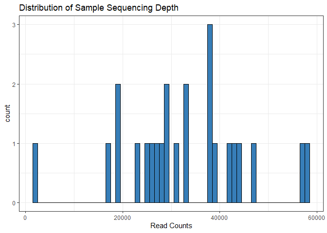
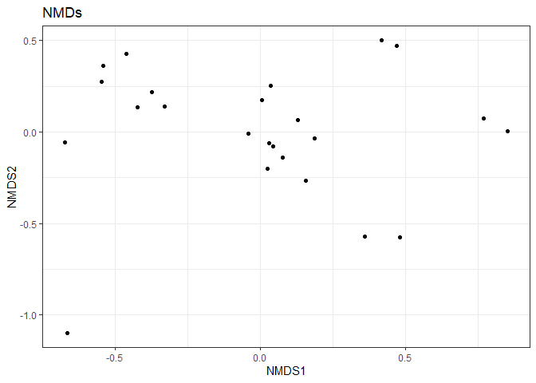
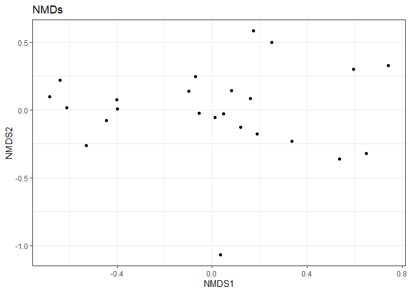
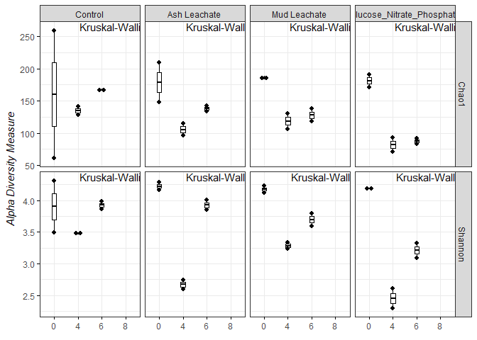
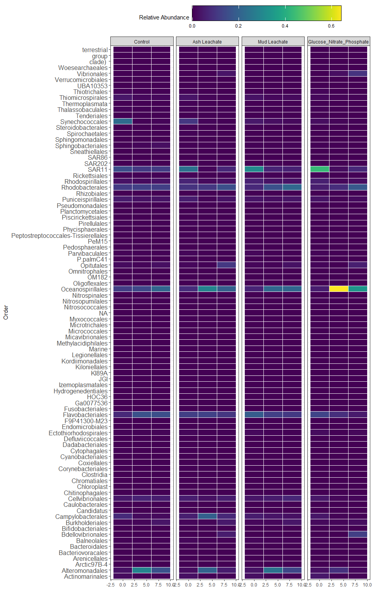

PhyloseqDATA
================
KentoLogan
11/20/2020

``` r
#BiocManager::install("phyloseq")
```

``` r
library(tidyverse)
```

    ## -- Attaching packages --------------------------------------- tidyverse 1.3.0 --

    ## v ggplot2 3.3.2     v purrr   0.3.4
    ## v tibble  3.0.3     v dplyr   1.0.2
    ## v tidyr   1.1.2     v stringr 1.4.0
    ## v readr   1.4.0     v forcats 0.5.0

    ## Warning: package 'readr' was built under R version 4.0.3

    ## -- Conflicts ------------------------------------------ tidyverse_conflicts() --
    ## x dplyr::filter() masks stats::filter()
    ## x dplyr::lag()    masks stats::lag()

``` r
library(phyloseq)
library(RColorBrewer)
```

    ## Warning: package 'RColorBrewer' was built under R version 4.0.3

``` r
library(readxl)
```

\#IMPORT DATA

``` r
count.tab<- read_rds("~/GitHub_Files/144l_students/Output_Data/seqtab-nochimtaxa.rds")
#TableOContents for each seq in each samp
tax.tab<- read_rds("~/GitHub_Files/144l_students/Output_Data/taxa.rds")
#Table matches ASV to seq
meta_data<- read_excel("~/GitHub_Files/144l_students/Input_Data/week3/144L_2018_BactAbund.xlsx", sheet= 1) %>% 
  select(Treatment, Bottle, Timepoint, DNA_SampleID) 

sample.tab<- read_rds("~/GitHub_Files/144l_students/Output_Data/DOC_BGE.rds") %>% 
 left_join(meta_data, .) %>% 
  mutate(hours= as.numeric(interv)/3600, 
         days= hours/24) %>% 
  drop_na(DNA_SampleID) %>% 
  column_to_rownames("DNA_SampleID") 
```

    ## Joining, by = c("Treatment", "Bottle", "Timepoint", "DNA_SampleID")

\#PHYLOSEQ OBJECT: Merge the Three Objects

``` r
OTU= otu_table(count.tab, taxa_are_rows = T)
TAX= tax_table(tax.tab)
SAM= sample_data(sample.tab)
ps= phyloseq(OTU, TAX, SAM)
```

\#FILTER SEQ: Filter Out Chloroplasts and Mitochondria

``` r
sub_ps<- ps %>% 
  subset_taxa(Family!= "Mitochondria" & Order!="Chloroplast")
test<- as.data.frame(sub_ps@tax_table)
```

\#SAMPLE SUMMARY

``` r
sample_sum_df<- data.frame(sum= sample_sums(sub_ps))
ggplot(sample_sum_df, aes(x= sum))+
  geom_histogram(color= "black", fill= "#377EB8", binwidth = 1000)+
  ggtitle("Distribution of Sample Sequencing Depth")+
  xlab("Read Counts")+
  theme(axis.title.y = element_blank())+
  theme_bw()
```

<!-- -->

\#BETA SAMPLING \#\#Subsample

``` r
ps_min<- rarefy_even_depth(sub_ps, sample.size = min(sample_sums(sub_ps)))
```

    ## You set `rngseed` to FALSE. Make sure you've set & recorded
    ##  the random seed of your session for reproducibility.
    ## See `?set.seed`

    ## ...

    ## 136OTUs were removed because they are no longer 
    ## present in any sample after random subsampling

    ## ...

``` r
mean(sample_sums(sub_ps))
```

    ## [1] 32752.42

``` r
mean(sample_sums(ps_min))
```

    ## [1] 2487

\#\#NMDS

``` r
set.seed(1)
nmds<- ordinate(sub_ps, method = "NMDS", distance = "bray")
```

    ## Square root transformation
    ## Wisconsin double standardization
    ## Run 0 stress 0.07076732 
    ## Run 1 stress 0.07076732 
    ## ... Procrustes: rmse 2.069425e-06  max resid 7.474416e-06 
    ## ... Similar to previous best
    ## Run 2 stress 0.07076734 
    ## ... Procrustes: rmse 3.095798e-05  max resid 0.0001153836 
    ## ... Similar to previous best
    ## Run 3 stress 0.07076739 
    ## ... Procrustes: rmse 2.700922e-05  max resid 5.796027e-05 
    ## ... Similar to previous best
    ## Run 4 stress 0.1135192 
    ## Run 5 stress 0.07076732 
    ## ... Procrustes: rmse 9.475217e-06  max resid 3.576866e-05 
    ## ... Similar to previous best
    ## Run 6 stress 0.0802345 
    ## Run 7 stress 0.1477068 
    ## Run 8 stress 0.07076732 
    ## ... Procrustes: rmse 5.14594e-06  max resid 1.109592e-05 
    ## ... Similar to previous best
    ## Run 9 stress 0.1473671 
    ## Run 10 stress 0.1524153 
    ## Run 11 stress 0.1134682 
    ## Run 12 stress 0.07076732 
    ## ... Procrustes: rmse 7.192518e-06  max resid 2.527606e-05 
    ## ... Similar to previous best
    ## Run 13 stress 0.07076732 
    ## ... Procrustes: rmse 4.806652e-06  max resid 1.052072e-05 
    ## ... Similar to previous best
    ## Run 14 stress 0.08011727 
    ## Run 15 stress 0.07076733 
    ## ... Procrustes: rmse 1.558748e-05  max resid 5.814502e-05 
    ## ... Similar to previous best
    ## Run 16 stress 0.07076732 
    ## ... Procrustes: rmse 1.286035e-05  max resid 4.73346e-05 
    ## ... Similar to previous best
    ## Run 17 stress 0.08093365 
    ## Run 18 stress 0.07076732 
    ## ... Procrustes: rmse 1.162589e-05  max resid 3.724403e-05 
    ## ... Similar to previous best
    ## Run 19 stress 0.08017099 
    ## Run 20 stress 0.07076732 
    ## ... Procrustes: rmse 1.173035e-05  max resid 4.434874e-05 
    ## ... Similar to previous best
    ## *** Solution reached

``` r
set.seed(1)
nmds_min<- ordinate(ps_min, method = "NMDS", distance = "bray")
```

    ## Square root transformation
    ## Wisconsin double standardization
    ## Run 0 stress 0.0871281 
    ## Run 1 stress 0.1426737 
    ## Run 2 stress 0.08716701 
    ## ... Procrustes: rmse 0.008123873  max resid 0.02814097 
    ## Run 3 stress 0.08712811 
    ## ... Procrustes: rmse 2.225283e-05  max resid 5.735329e-05 
    ## ... Similar to previous best
    ## Run 4 stress 0.08753179 
    ## ... Procrustes: rmse 0.01410308  max resid 0.05382879 
    ## Run 5 stress 0.1691262 
    ## Run 6 stress 0.09499975 
    ## Run 7 stress 0.1622982 
    ## Run 8 stress 0.08837765 
    ## Run 9 stress 0.1639784 
    ## Run 10 stress 0.1289416 
    ## Run 11 stress 0.1336293 
    ## Run 12 stress 0.08716701 
    ## ... Procrustes: rmse 0.008126825  max resid 0.02814557 
    ## Run 13 stress 0.158216 
    ## Run 14 stress 0.159576 
    ## Run 15 stress 0.0883776 
    ## Run 16 stress 0.08753179 
    ## ... Procrustes: rmse 0.01410112  max resid 0.05382762 
    ## Run 17 stress 0.08716701 
    ## ... Procrustes: rmse 0.008117184  max resid 0.02810072 
    ## Run 18 stress 0.1690418 
    ## Run 19 stress 0.09402422 
    ## Run 20 stress 0.1277714 
    ## *** Solution reached

``` r
levels<-c("Control", "Ash Leachate", "Mud Leachate", "Glucose_Nitrate_Phosphate")

nmds.plot<- plot_ordination(sub_ps, nmds, title = "NMDs")+
  geom_point(aes(fill= days, shape= factor(Treatment, levels = levels)), alpha= 0.6, stroke= 2, size= 4)+
  scale_shape_manual(values = c(21,22,23))+
  scale_fill_gradient(low = "#0db5e6", high= "#d31f2a")+
  theme_bw()

nmds.plot$layers<- nmds.plot$layers[1]
nmds.plot+
  facet_grid()+
  guides(fill= guide_colorbar(title = "Days"), shape= guide_legend(title = "Treatment"))
```

<!-- -->

``` r
levels<-c("Control", "Ash Leachate", "Mud Leachate", "Glucose_Nitrate_Phosphate")

nmds_min.plot<- plot_ordination(sub_ps, nmds_min, title = "NMDs")+
  geom_point(aes(fill= days, shape= factor(Treatment, levels = levels)), alpha= 0.6, stroke= 2, size= 4)+
  scale_shape_manual(values = c(21,22,23))+
  scale_fill_gradient(low = "#0db5e6", high= "#d31f2a")+
  theme_bw()
  

nmds_min.plot$layers<- nmds_min.plot$layers[1]
nmds_min.plot+
  facet_grid()+
  guides(fill= guide_colorbar(title = "Days"), shape= guide_legend(title = "Treatment"))
```

<!-- -->

ALPHA DIVERSITY

``` r
richness<- estimate_richness(ps_min, measures = c("Chao1", "Shannon")) %>% 
  rownames_to_column(., var = "DNA_ID") %>% 
  mutate_at(vars(DNA_ID), str_replace_all, pattern= "X144", "144")
```

``` r
alphadiv<- left_join(richness, sample.tab %>% 
                       rownames_to_column(., var = "DNA_ID"))
```

    ## Joining, by = "DNA_ID"

``` r
#install.packages("ggpubr")
library(ggpubr)
```

    ## Warning: package 'ggpubr' was built under R version 4.0.3

``` r
pivot.data<- alphadiv %>% 
  select(Treatment, Bottle, Timepoint, days, Chao1, Shannon) %>% 
  pivot_longer(., cols= c(Chao1, Shannon), names_to="measure", values_to= "est") %>% 
  left_join(., alphadiv %>% 
              select(Treatment, Bottle, Timepoint, days, se.chao1)) %>% 
  mutate(se.chao1= ifelse(measure== "Chao1", se.chao1, NA))
```

    ## Joining, by = c("Treatment", "Bottle", "Timepoint", "days")

``` r
alpha.plot<- ggboxplot(pivot.data, x= "Timepoint", y= "est", 
                       xlab = expression(italic(paste(""))),
                       ylab =expression(italic(paste("Alpha Diversity Measure"))),
                       add = "dotplot",
                       width= 0.2,
                       ggtheme= theme_bw())+
  stat_compare_means(label.x= "6")+
facet_grid(measure~ factor(Treatment, levels = levels), scales = "free")

alpha.plot
```

    ## `stat_bindot()` using `bins = 30`. Pick better value with `binwidth`.

<!-- -->

\#Who Contributes?

``` r
ps_std<- transform_sample_counts(ps_min, function(x) x/ sum(x))

ps_std.tab<- as(otu_table(ps_std), "matrix")

ps_std.df<- as.data.frame(ps_std.tab)
```

\#Table

``` r
tax.df<- as.data.frame(tax.tab)
custom.tab<- tax.df %>% 
  rownames_to_column(., var = "asv") %>% 
  left_join(., ps_std.df %>%  rownames_to_column(., var= "asv")) %>% 
  mutate(pco= paste(Phylum, "_", Class, "_", Order)) %>% 
  select(pco, everything()) %>% 
  group_by(pco) %>% 
  summarise_at(vars(contains(c("144"))), sum, na.rm= T) %>% 
  ungroup()
```

    ## Joining, by = "asv"

``` r
colnames<-custom.tab[,1]
t_custom.tab<- as.data.frame(t(custom.tab[,-1]))
colnames(t_custom.tab)<- colnames$pco
```

``` r
sweet.tab<- t_custom.tab %>% 
  rownames_to_column(.,var = "sample") %>% 
  left_join(., sample.tab %>% rownames_to_column(., var= "sample") %>% 
              select(sample, Treatment, Bottle, Experiment, Timepoint, days, cells)) %>% 
  select(sample: cells, everything())
```

    ## Joining, by = "sample"

``` r
relabund<- sweet.tab %>% 
  select(-c(sample:cells)) %>% 
  .[ , colSums(.)>0] %>% 
  .[, order(colSums(-.))] %>% 
  bind_cols(sweet.tab %>% select(sample:cells), .) %>% 
  select(sample:cells, everything())
```

\#\#Heat

``` r
relaheat.data<-relabund %>% 
  select(-c(sample, Experiment, Bottle, days, cells)) %>% 
  pivot_longer(.,-c(Treatment:Timepoint), names_to= "taxa", 
               values_to= "relabund") %>% 
  separate(taxa, into= c("p", "c", "o"), sep= "_")
```

    ## Warning: Expected 3 pieces. Additional pieces discarded in 432 rows [18, 26, 29,
    ## 32, 37, 38, 39, 40, 42, 60, 74, 79, 82, 87, 90, 92, 93, 96, 118, 126, ...].

``` r
#install.packages("viridis")
library(viridis)
```

    ## Warning: package 'viridis' was built under R version 4.0.3

    ## Loading required package: viridisLite

``` r
relaheat<- relaheat.data %>% 
  ggplot(aes(x= Timepoint, y= o))+
  geom_tile(aes(fill= relabund), color="white")+
  scale_fill_viridis(option = "D")+
  labs(x="", y= "Order", fill= "Relative Abundance")+
  facet_grid(~factor(Treatment, levels = levels))+
  theme_bw()+
  theme(axis.text.y = element_text(size= 12), 
        legend.position = "top")+
  guides(fill=guide_colourbar(barheight = 2, barwidth = 20, frame.colour = "black", ticks.linewidth = 1), color= F)

relaheat
```

<!-- --> \#Save

``` r
saveRDS(sweet.tab, "~/GitHub_Files/144l_students/Output_Data/Custom_ASV_Table.rds")
saveRDS(sub_ps, "~/GitHub_Files/144l_students/Output_Data/PHYLOSEQ.rds")
saveRDS(ps_min, "~/GitHub_Files/144l_students/Output_Data/Subset_PHYLOSEQ.rds")
saveRDS(alphadiv, "~/GitHub_Files/144l_students/Output_Data/alphadiv.rds")
```
